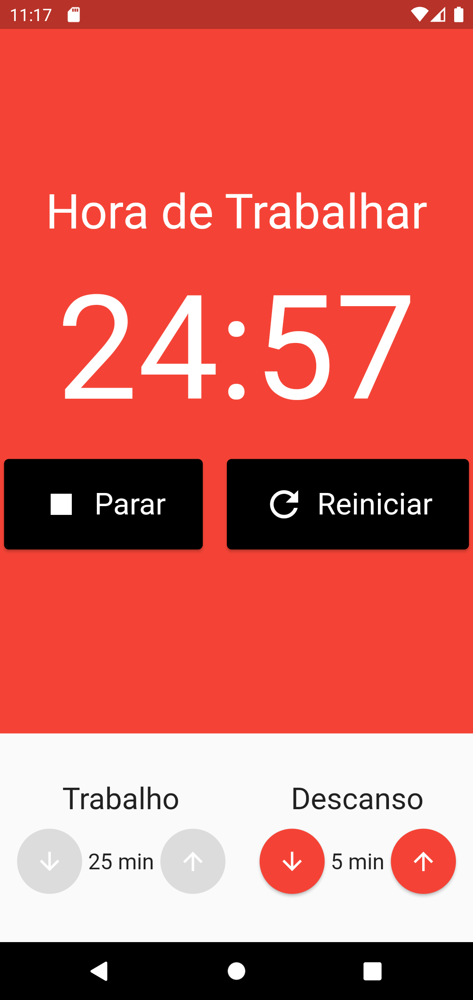
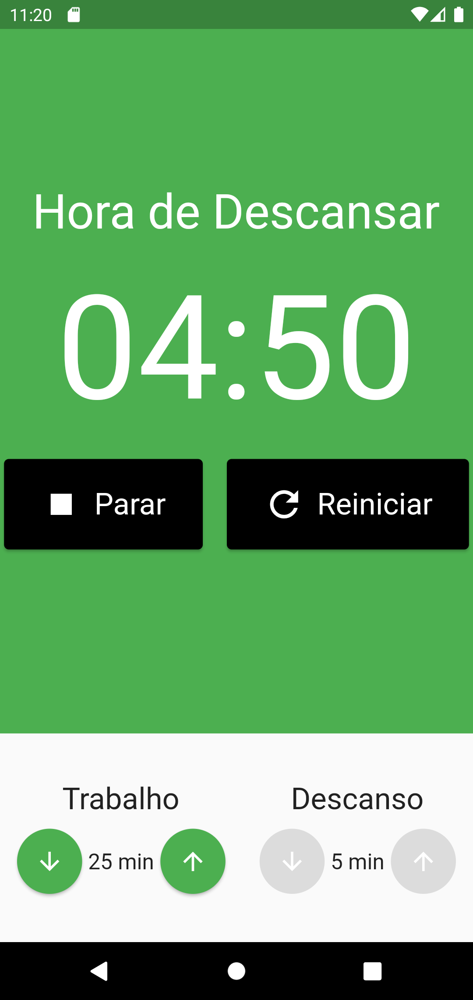

# Pomodoro - Flutter App

This is a pomodoro application developed in Flutter with the purpose of practicing and learning the framework and state management libraries such as MobX and Provider.

  
  
  
  
  
  

## Technologies Used

- Flutter
- Dart
- MobX
- Provider
- Dart Dev Tools

## Screenshots

    
    

## Getting Started

To run this app on your machine, follow these steps:

1. Clone this repository to your local machine.
2. Open the project directory in a code editor.
3. Run `flutter pub get` to install the project dependencies.
4. Connect a device or start an emulator.
5. Run `flutter run` to launch the app on your device or emulator.

## Contributions

Contributions are always welcome! If you find any issues or have suggestions for improvements, feel free to open an issue or a pull request.

## License

This project is licensed under the [MIT License](LICENSE).
